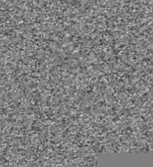

# Keras implementation of Deep Convolutional Generative Adversarial Networks (DCGAN)

This is an implementation of DCGAN (Link to the paper: http://arxiv.org/abs/1511.06434) with Keras on top of TensorFlow. Two adversarial networks are trained on real images for generating artificial images that seems real.

# Requirements

Install using `pip install -r requirements.txt`

You will also need to ensure the proper CUDA libraries and NVIDIA drivers are installed.

# Usage

The `dcgan.py` script enables training of the DCGAN model with MNIST dataset and subsequently generate artificial images from the trained model.

## Training:
`python dcgan.py --mode train --batch_size <batch_size> --num_epoch <num_epoch>`

Example:

`python dcgan.py --mode train --batch_size 128 --num_epoch 100`

## Generate images:
`python dcgan.py --mode generate --batch_size <batch_size>`

Note: the `batch_size` value for generating images must equal to the `batch_size` value used during the training step.

Similarly, the optional `--pretty` flag will generate the top 5% artificial image determined by the discriminator.

`python dcgan.py --mode generate --batch_size <batch_size> --pretty`

Example:

`python dcgan.py --mode generate --batch_size 128`

or

`python dcgan.py --mode generate --batch_size 128 --pretty`

# Result

## Training progress:

Animation shows generated images during the training process of DCGAN over 100 epochs.

